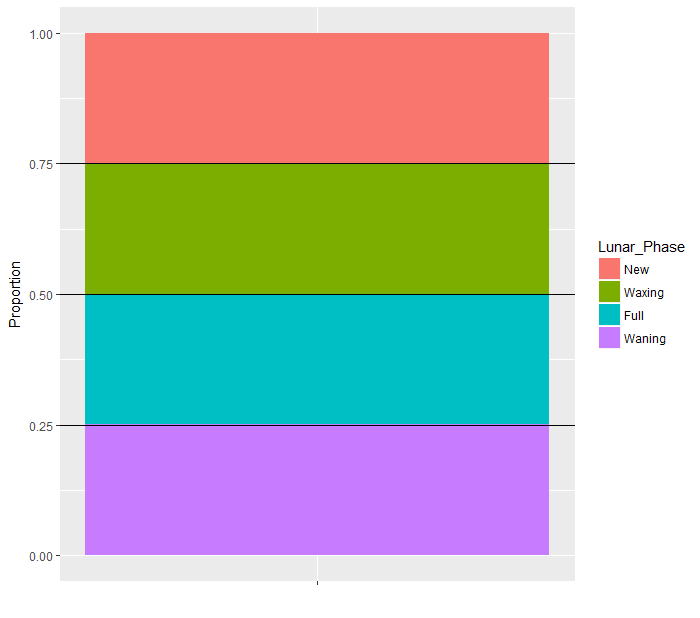
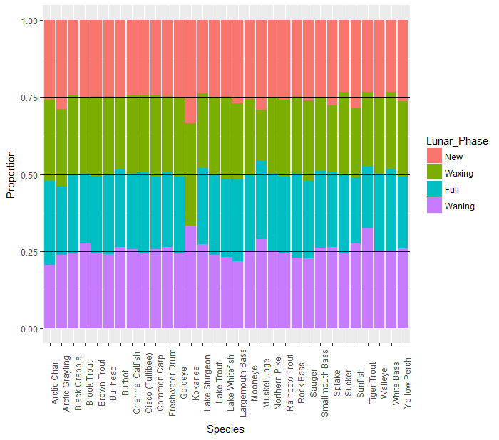

# Data collection an analysis of the effect of moon phases on trophy fishing

Since I’ve started fishing I’ve heard about the importance of moon phases. Every In-Fisherman magazine I had as a kid published them, and all these years later they still publish a moon phases calendar on their website. Some people even go as far only to fish during prime moon phases.

I was curious to get a definitive answer, so I decided to use my programming and data analysis skills to determine how much truth there are to these claims.

This analysis comes for over 350,000 Manitoba master angler records (the oldest master angler program in North America). For every master angler caught since the program began over 60 years ago, I tallied the number of master anglers caught during each of the four moon phases: new moon, waxing, full, and waning.

We can see on the graph below there is almost a perfectly equal number of fish caught in each of the four moon phases. This shows there doesn’t seem to be any affect of the moon phases on the number of trophy fish caught.

However, these results are for all fish species aggregated together. It’s possible that while the moon phases don’t affect fishing overall, maybe for certain species the moon phases play a big role when the trophies are caught.

I conducted the same analysis again, but for each species separately, which you can see on the graph below. We largely see the same pattern of results. There really doesn’t seem to be any effect of the number of master anglers that are caught during the four different moon phases.

There are a few possible exception species: Kokane, Musky, and Tiger Trout. We can look at the numbers a little more closely:

New/Waxing/Full/Waning: 

Kokanee: 1/1/0/1

Muskellunge: 47/27/41/47

Tiger trout: 224/233/195/313

Not enough Kokanee have been caught to make any strong claims. There does seem moon phases could be more productive for catching trophy musky and tiger trout. However, when you consider all the others species for which there is no apparent advantage of the moon phases, and the fact that anglers may target certain moon phases more, it is hard to draw a strong conclusion for musky and tiger trout.

In sum, with possibly two exceptions, moon phases appear to play no role in the number of trophy fish caught.
